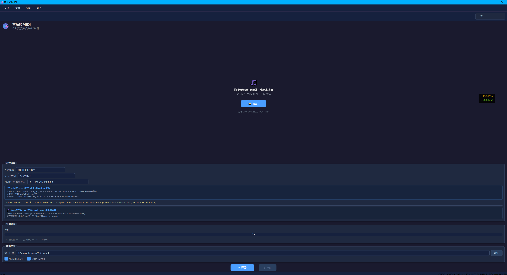
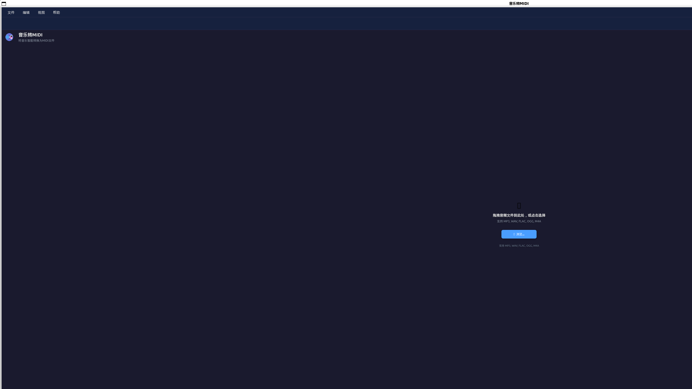

# Music to MIDI Converter

<p align="center">
  <a href="./README_zh.md">中文</a> | English
</p>

Convert audio files to multi-track MIDI with automatic 128 GM instrument recognition.

**Platform Support: Windows / Linux / WSL2**

## Screenshots

| Windows | Linux |
|---------|-------|
|  |  |

## Features

- **Multi-Instrument Transcription**: Uses YourMT3+ MoE (2025 AMT Challenge SOTA) for direct multi-instrument recognition from mixed audio
- **128 GM Instruments**: Outputs standard General MIDI multi-track MIDI, accurately distinguishing drums, bass, guitar, piano, etc.
- **MIDI Post-processing**: Note quantization, velocity smoothing, deduplication, polyphony limiting
- **GPU Acceleration**: Auto-detects and uses CUDA (NVIDIA) / ROCm (AMD) / CPU
- **Multi-language UI**: Support for English and Chinese interface
- **Professional Dark Theme**: Modern audio software-style interface design

## Platform Support

| Platform | Status | Notes |
|----------|--------|-------|
| Windows 10/11 (x64) | ✅ Supported | Double-click `run.bat` to launch |
| Linux (Ubuntu/Debian) | ✅ Supported | Full functionality, Ubuntu 22.04+ recommended |
| WSL2 (Windows 11) | ✅ Supported | Requires WSLg (built-in on Win11) |
| macOS | 🚧 Planned | Apple Silicon MPS support in development |

## Quick Start

### Windows

```
1. Clone or download the repository
2. Double-click run.bat (auto-installs all dependencies on first run)
```

Or use PowerShell:
```powershell
powershell -ExecutionPolicy Bypass -File run.ps1
```

### Linux

```bash
# 1. Clone the repository
git clone https://github.com/mason369/music-to-midi.git
cd music-to-midi

# 2. Run directly (auto-installs all dependencies on first run)
./run.sh
```

## Installation

### Prerequisites

- **Python 3.10+** (3.10 or 3.11 recommended, 3.12 may have compatibility issues)
- **FFmpeg**: Required for audio processing
  - Windows: `choco install ffmpeg` or download from [ffmpeg.org](https://ffmpeg.org/download.html)
  - Linux: `sudo apt install ffmpeg` (Ubuntu/Debian) or `sudo dnf install ffmpeg` (Fedora)
  - macOS: `brew install ffmpeg`
- **Git LFS** (optional, required to install YourMT3+ code)
- **NVIDIA GPU + CUDA** (recommended): For significantly faster processing

### Git LFS Installation

- Windows:
  - `choco install git-lfs` or `winget install GitHub.GitLFS`
  - After install: `git lfs install`
- macOS:
  - `brew install git-lfs`
  - After install: `git lfs install`
- Linux:
  - Ubuntu/Debian: `sudo apt-get install git-lfs`
  - Fedora: `sudo dnf install git-lfs`
  - After install: `git lfs install`

### Dependency Requirements

| Dependency | Version | Notes |
|------------|---------|-------|
| PyTorch | 2.1.0 - 2.4.x | YourMT3+ compatibility |
| torchaudio | 2.1.0 - 2.4.x | Must match PyTorch version |
| NumPy | < 2.0 | numba compatibility |
| CUDA | 11.8 or 12.1 | GPU acceleration (optional) |
| Python | 3.10+ | 3.10 or 3.11 recommended |

### Linux Installation (Recommended)

Linux is the recommended platform for running this project - environment setup is simpler and GPU acceleration is more stable.

```bash
# 1. Clone the repository
git clone https://github.com/mason369/music-to-midi.git
cd music-to-midi

# 2. Create virtual environment (conda recommended)
conda create -n music2midi python=3.10
conda activate music2midi

# Or use venv
python -m venv venv
source venv/bin/activate

# 3. Install PyTorch (choose based on your CUDA version)
# CUDA 11.8
pip install torch==2.4.0 torchaudio==2.4.0 --index-url https://download.pytorch.org/whl/cu118

# CUDA 12.1
pip install torch==2.4.0 torchaudio==2.4.0 --index-url https://download.pytorch.org/whl/cu121

# CPU only (not recommended, slower)
pip install torch==2.4.0 torchaudio==2.4.0 --index-url https://download.pytorch.org/whl/cpu

# 4. Install project dependencies
pip install -r requirements.txt

# 5. Install YourMT3+ code (optional, for 128 instrument recognition)
git lfs install
git clone https://huggingface.co/spaces/mimbres/YourMT3
cd YourMT3
pip install -r requirements.txt
# Linux optional: only required for GuitarSet preprocessing
sudo apt-get install sox
cd ..
# Or run the install script
bash install_yourmt3_code.sh

# 6. Download YourMT3+ models (optional)
python download_sota_models.py

# 7. Run the application
python -m src.main
```

### Windows Installation

Note: `tflite-runtime` is not available on Windows. `requirements.txt` uses a platform marker to install `tensorflow` instead, so make sure you are using a recent version of `pip`.

```bash
# Clone the repository
git clone https://github.com/mason369/music-to-midi.git
cd music-to-midi

# Create virtual environment
python -m venv venv
venv\Scripts\activate

# Install PyTorch (choose one)
# CUDA 11.8
pip install torch==2.4.0 torchaudio==2.4.0 --index-url https://download.pytorch.org/whl/cu118

# CUDA 12.1
pip install torch==2.4.0 torchaudio==2.4.0 --index-url https://download.pytorch.org/whl/cu121

# CPU only (no GPU or no CUDA needed)
pip install torch==2.4.0 torchaudio==2.4.0 --index-url https://download.pytorch.org/whl/cpu

# Install dependencies
pip install -r requirements.txt

# Optional: install YourMT3+ code (for 128-instrument recognition)
git lfs install
git clone https://huggingface.co/spaces/mimbres/YourMT3
cd YourMT3
pip install -r requirements.txt
cd ..

# Optional: download YourMT3+ models
python download_sota_models.py

# Run the application
python -m src.main
```

### CUDA Installation Guide

#### Linux (Ubuntu/Debian)

```bash
# Method 1: Using NVIDIA official repository
wget https://developer.download.nvidia.com/compute/cuda/repos/ubuntu2204/x86_64/cuda-keyring_1.1-1_all.deb
sudo dpkg -i cuda-keyring_1.1-1_all.deb
sudo apt-get update
sudo apt-get install cuda-toolkit-12-1

# Method 2: Using conda (recommended, automatic management)
conda install pytorch torchvision torchaudio pytorch-cuda=12.1 -c pytorch -c nvidia

# Verify CUDA
python -c "import torch; print(f'CUDA: {torch.cuda.is_available()}, GPU: {torch.cuda.get_device_name(0) if torch.cuda.is_available() else \"N/A\"}')"
```

#### Windows

1. Download CUDA Toolkit from [NVIDIA website](https://developer.nvidia.com/cuda-downloads)
2. Choose custom installation, ensure cuDNN is selected
3. Restart and verify: `nvidia-smi`

### Install from Release

Download the latest release from the [Releases](https://github.com/mason369/music-to-midi/releases) page.

## Usage

1. **Open Audio File**: Drag and drop an audio file (MP3, WAV, FLAC, OGG) or click to browse
2. **Configure Output**: Choose output directory and options (MIDI, lyrics, separated tracks)
3. **Start Processing**: Click "Start" to begin conversion
4. **Get Results**: Find MIDI file, LRC lyrics, and separated audio tracks in output directory

## Supported Formats

### Input
- MP3, WAV, FLAC, OGG, M4A, AAC, WMA

### Output
- MIDI (.mid) - Multi-track MIDI

## Technical Details

### AI Models Used

This project uses **YPTF.MoE+Multi (PS)** — the highest-performance variant in the YourMT3+ family.

| Item | Details |
|------|---------|
| Full Name | YPTF.MoE+Multi (PS) |
| Checkpoint | `mc13_256_g4_all_v7_mt3f_sqr_rms_moe_wf4_n8k2_silu_rope_rp_b80_ps2` |
| Source | [KAIST - YourMT3+](https://huggingface.co/spaces/mimbres/YourMT3) ([arXiv:2407.04822](https://arxiv.org/abs/2407.04822)) |
| Architecture | Perceiver Transformer Encoder + Multi-T5 Decoder |
| MoE | 8 Experts, Top-2 Routing, SiLU Activation |
| Position Encoding | RoPE (Partial Rotary Position Embedding) |
| Normalization | RMSNorm |
| Training Augmentation | Pitch Shift (PS) |
| Model Size | ~2.5 GB |
| Task Type | `mt3_full_plus` (128 GM instruments + drums) |

#### Benchmark (Slakh2100 Dataset)

| Metric | YPTF.MoE+Multi (PS) | MT3 (Google Baseline) |
|--------|---------------------|----------------------|
| Multi F1 | **0.7484** | 0.62 |
| Frame F1 | 0.8487 | — |
| Onset F1 | 0.8419 | — |
| Offset F1 | 0.6961 | — |
| Drum Onset F1 | 0.9113 | — |

Per-instrument Onset F1: Bass 0.93 / Piano 0.88 / Guitar 0.82 / Synth Lead 0.82 / Brass 0.73 / Strings 0.73

#### Available Model Variants

| Model | MoE | Pitch Shift | Size | Notes |
|-------|-----|-------------|------|-------|
| YPTF.MoE+Multi (PS) | ✅ 8 experts | ✅ | 2.5 GB | **Default, highest performance** |
| YPTF.MoE+Multi (noPS) | ✅ 8 experts | ❌ | 2.5 GB | Without pitch shift augmentation |
| YPTF+Multi (PS) | ❌ | ✅ | 2.0 GB | Standard Perceiver, lighter |
| YPTF+Multi (noPS) | ❌ | ❌ | 2.0 GB | Standard Perceiver, no augmentation |
| YourMT3+ Legacy | ❌ | ❌ | 2.0 GB | Backward compatibility |

#### Future / Emerging Transcription Models

Models and research directions that emerged after 2025:

| Model / Direction | Source | Type | Status | Notes |
|-------------------|--------|------|--------|-------|
| [Aria-AMT5](https://github.com/EleutherAI/aria-amt) | EleutherAI | Piano | ✅ Open Source | Whisper-based piano transcription, used to generate 1M+ MIDI dataset in 2025, new piano SOTA |
| Streaming AMT | arXiv 2025 | Multi-instrument | 📄 Paper | Conv encoder + autoregressive Transformer decoder, real-time streaming, near offline SOTA |
| 2025 AMT Challenge Winners | ISMIR 2025 | Multi-instrument | 📄 Paper | 8 teams competed, 2 beat MT3 baseline, focused on synthesized classical music |
| CVC Framework | ISMIR 2025 | Evaluation | 📄 Paper | Cross-Version Consistency, annotation-free evaluation for orchestral scenarios |

#### Existing Models in the Same Domain

| Model | Source | Type | Notes |
|-------|--------|------|-------|
| [MT3](https://github.com/magenta/mt3) | Google Magenta | Multi-instrument | Transformer enc-dec, base architecture of YourMT3+, Multi F1=0.62 (Slakh) |
| [Omnizart](https://github.com/Music-and-Culture-Technology-Lab/omnizart) | MCT Lab | Multi-task | Piano/drums/vocal/chord transcription, no major 2025 update |
| [Basic Pitch](https://github.com/spotify/basic-pitch) | Spotify | General | Lightweight mono/polyphonic, fast inference, lower accuracy than MT3 family |

> **Trend Summary**: As of 2025, multi-instrument AMT is still dominated by MT3/YourMT3+ Transformer architectures. Piano transcription is the most mature area (Aria-AMT5). Multi-instrument and guitar tablature transcription remain active research frontiers. Real-time streaming and large-scale annotation-free evaluation are emerging topics.

### Architecture

```
Audio Input → MusicToMidiPipeline
                ↓
            YourMT3+ MoE (YPTF.MoE+Multi PS)
            Direct multi-instrument transcription from mixed audio
                ↓
            MIDI Post-processing (quantization / dedup / polyphony limit)
                ↓
            Multi-track MIDI Output (up to 128 GM instruments)
```

## Development

### Setup Development Environment

```bash
# Install dev dependencies
pip install -r requirements-dev.txt

# Run tests
pytest

# Run specific tests
pytest tests/test_yourmt3_integration.py -v

# Optional: coverage report (generates htmlcov/ and .coverage)
pytest --cov=src --cov-report=html

# Format code
black src/
isort src/

# Type checking
mypy src/
```

### Build Executable

```bash
# Install PyInstaller
pip install pyinstaller

# Build using project spec file (recommended)
pyinstaller MusicToMidi.spec

# Build output is in dist/MusicToMidi/ directory
```

### GPU Diagnostics

```bash
# Check GPU status
python -c "from src.utils.gpu_utils import print_gpu_diagnosis; print_gpu_diagnosis()"

# Check YourMT3+ availability
python -c "from src.core.yourmt3_transcriber import YourMT3Transcriber; print(YourMT3Transcriber.is_available())"
```

## Troubleshooting

### Linux Environment Issues

**Q: Missing libGL.so.1**
```bash
# Ubuntu/Debian
sudo apt install libgl1-mesa-glx

# CentOS/RHEL
sudo yum install mesa-libGL
```

**Q: PyQt6 won't start, shows "could not load Qt platform plugin"**
```bash
# Install Qt dependencies
sudo apt install libxcb-xinerama0 libxkbcommon-x11-0

# If running on headless server, need virtual display
sudo apt install xvfb
xvfb-run python -m src.main
```

**Q: CUDA not available**
```bash
# Check NVIDIA driver
nvidia-smi

# Check PyTorch CUDA
python -c "import torch; print(torch.cuda.is_available())"

# If returns False, reinstall correct PyTorch version
pip uninstall torch torchaudio
pip install torch==2.4.0 torchaudio==2.4.0 --index-url https://download.pytorch.org/whl/cu118
```

**Q: YourMT3+ not available**
```bash
# Ensure YourMT3 code exists
ls YourMT3/

# If not exists, clone the repository (requires Git LFS)
git lfs install
git clone https://huggingface.co/spaces/mimbres/YourMT3
cd YourMT3
pip install -r requirements.txt
cd ..

# Download models
python download_sota_models.py
```

## Contributing

Contributions are welcome! Please feel free to submit a Pull Request.

1. Fork the repository
2. Create your feature branch (`git checkout -b feature/amazing-feature`)
3. Commit your changes (`git commit -m 'Add amazing feature'`)
4. Push to the branch (`git push origin feature/amazing-feature`)
5. Open a Pull Request

## License

This project is licensed under the MIT License - see the [LICENSE](../LICENSE) file for details.

## Acknowledgments

- [YourMT3+](https://huggingface.co/spaces/mimbres/YourMT3) - 2025 AMT Challenge SOTA multi-instrument transcription
- [mido](https://github.com/mido/mido) - MIDI file handling
- [librosa](https://librosa.org/) - Audio analysis

## Support

If you encounter any issues, please [open an issue](https://github.com/mason369/music-to-midi/issues).
