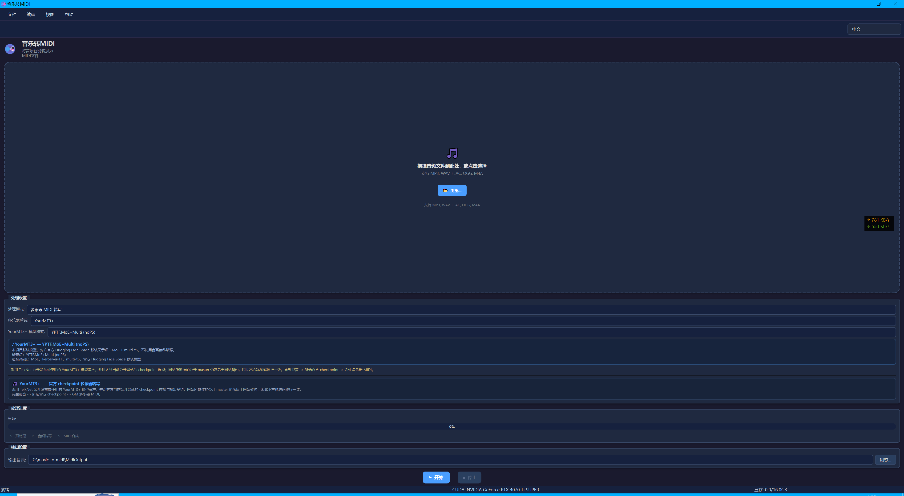
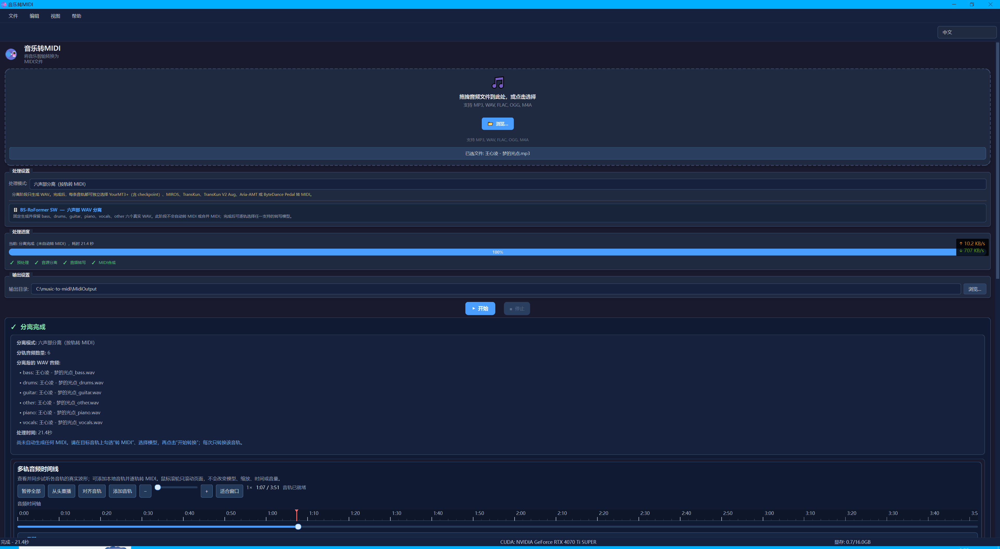
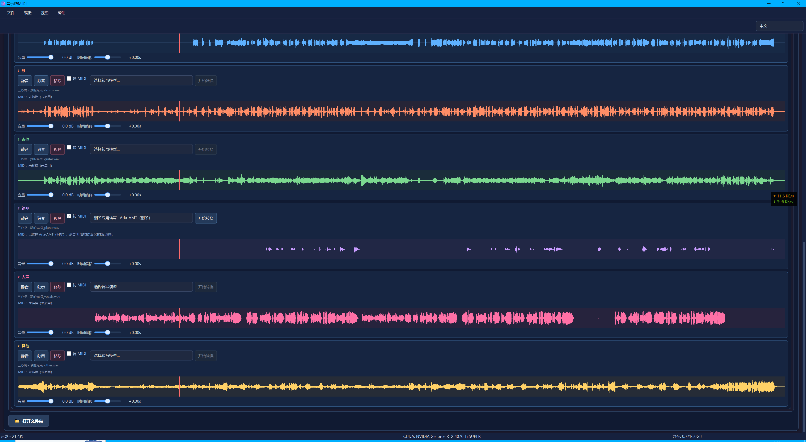
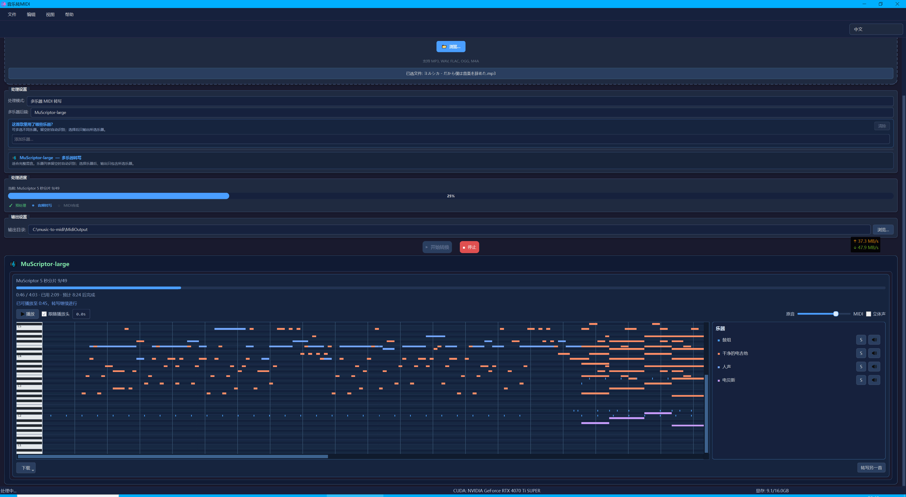

# 音乐转 MIDI 转换器

<p align="center">
  中文 | <a href="./README.md">English</a>
</p>

一个基于 AI 的音频转 MIDI 工具，提供 PyQt6 桌面版、Gradio Web 版和 Google Colab 运行入口。当前版本同步七种处理模式：完整混音多乐器转写、人声/伴奏分离后分别转写、六声部分离后逐 stem 转写，以及 TransKun 默认 V2 / TransKun V2 Aug / Aria-AMT / ByteDance Pedal 四条钢琴专用转写流程。

## 统一界面演示

桌面版、Gradio Web 版和 Google Colab 采用同一套七模式工作流与操作语义。以下演示按“主界面 → 分离完成 → 逐轨处理 → MuScriptor 渐进式预览”的顺序展示核心流程。

### 1. 主界面与完整混音转写



### 2. 六声部分离完成



### 3. 六声部波形与逐轨转 MIDI 控件



### 4. MuScriptor 边转写边预览 MIDI



## 当前能力

- **完整混音转写**：`SMART` 模式直接读取整首音频，用多乐器后端生成 MIDI。
- **人声/伴奏分离与逐轨转写**：`VOCAL_SPLIT` 模式用 BS-RoFormer Leap XE 90-band 提取 vocals、BS PolarFormer 提取 accompaniment，主流程先交付两条真实 WAV；每条 WAV 再在音轨工作台中独立选择转写路线。
- **六声部分离与逐轨转写**：`SIX_STEM_SPLIT` 模式用 `BS-Rofo-SW-Fixed.ckpt` 分离 `bass / drums / guitar / piano / vocals / other` 六个真实 WAV；分离阶段不自动生成或合并 MIDI。
- **钢琴专用转写**：`PIANO_TRANSKUN`、`PIANO_TRANSKUN_V2_AUG`、`PIANO_ARIA_AMT` 与 `PIANO_BYTEDANCE_PEDAL` 面向纯钢琴音频，分别调用 TransKun 默认 V2、官方 V2 Aug、Aria-AMT 和 ByteDance 带踏板模型。
- **默认后端语义**：多乐器默认后端为 YourMT3+ 官方 `YPTF.MoE+Multi (noPS)`；`SMART` 可显式选择 YourMT3+、MIROS 或 MuScriptor Large，分离结果逐轨提供同样三类多乐器路线。
- **11 条逐轨路线**：五个 YourMT3+ checkpoint、MIROS、MuScriptor Large，以及 TransKun V2、TransKun V2 Aug、Aria-AMT、ByteDance Pedal 四个钢琴后端。每条 WAV 的路线和是否转换都由用户明确选择。
- **官方转写结果**：YourMT3+ 与 MIROS 保留各自官方 writer 输出，MuScriptor 使用官方事件与 MIDI writer 并严格校验乐器约束；项目不做量化、去重、短音符过滤、力度平滑、复音限制或 `NoteEvent` 重建。
- **多格式输入**：支持 `MP3`、`WAV`、`FLAC`、`OGG`、`M4A`。非 WAV 必须通过 FFmpeg 转为 44.1 kHz PCM WAV；FFmpeg 失败会停止并显示 stderr 根因。
- **多平台入口**：桌面版、Space、Colab 均同步暴露七种处理模式。

## 不同入口的功能范围

| 入口 | 处理模式 | 后端选择 | 适合场景 |
|------|----------|----------|----------|
| PyQt6 桌面版 | `SMART`、`VOCAL_SPLIT`、`SIX_STEM_SPLIT`、`PIANO_TRANSKUN`、`PIANO_TRANSKUN_V2_AUG`、`PIANO_ARIA_AMT`、`PIANO_BYTEDANCE_PEDAL` | SMART 可选 YourMT3+ / MIROS / MuScriptor；分离结果逐轨选择 11 条路线；钢琴模式使用各自固定后端 | 本地长期使用、GPU 推理、批量输出文件、钢琴专用转写 |
| Gradio Space | 同桌面七种模式 | 同步提供 MuScriptor 乐器硬约束与 11 条逐轨路线 | 浏览器中快速试用或部署 |
| Google Colab | 同桌面七种模式 | 与 Space 同步 MuScriptor 约束和逐轨结果工作台 | 临时使用 Colab GPU |

## 处理模式

| 模式 | 内部流程 | 主要输出 | 说明 |
|------|----------|----------|------|
| `SMART` | 音频 -> 所选 YourMT3+ / MIROS / MuScriptor Large -> MIDI | `<歌曲名>.mid` | 不做音源分离；MuScriptor 非空乐器选择会成为真实解码约束。 |
| `VOCAL_SPLIT` | 音频 -> Leap XE vocals + PolarFormer accompaniment -> 两条 WAV -> 逐轨显式转 MIDI | `<歌曲名>_vocals.wav`、`<歌曲名>_accompaniment.wav`；按需生成逐轨 MIDI | 分离阶段不自动转 MIDI，每条 WAV 可独立选择 11 条路线。 |
| `SIX_STEM_SPLIT` | 音频 -> `BS-Rofo-SW-Fixed.ckpt` -> 六条 WAV -> 逐轨显式转 MIDI | `<歌曲名>_<stem>.wav`；按需生成逐轨 MIDI | 每条真实 WAV 的路线和是否转换均由用户明确选择，不自动合并 MIDI。 |
| `PIANO_TRANSKUN` | 音频 -> TransKun 默认 V2 模型 -> MIDI | `<歌曲名>_piano_transkun.mid` | 适合纯钢琴音频；使用 PyPI 包随附 checkpoint。 |
| `PIANO_TRANSKUN_V2_AUG` | 音频 -> 官方 TransKun V2 Aug checkpoint -> MIDI | `<歌曲名>_piano_transkun_v2_aug.mid` | 独立模式，不会在默认 V2 失败时静默接管；需要独立下载并校验 V2 Aug 资源。 |
| `PIANO_ARIA_AMT` | 音频 -> Aria-AMT 钢琴模型 -> MIDI | `<歌曲名>_piano_aria.mid` | 适合纯钢琴音频；需要 Aria-AMT checkpoint 已随包或在模型目录可用。 |
| `PIANO_BYTEDANCE_PEDAL` | 音频 -> ByteDance 带踏板钢琴模型 -> MIDI | `<歌曲名>_piano_bytedance_pedal.mid` | 适合纯钢琴音频；会保留延音踏板 CC64；需要 ByteDance Piano checkpoint 已随包或在模型目录可用。 |

## 输出文件

桌面版默认输出到：

```text
MidiOutput/<音频文件名>/
```

如果同名目录已存在，会自动使用 `<音频文件名>_2`、`<音频文件名>_3` 等后缀。

常见输出：

```text
song.mid
song_accompaniment.mid
song_vocal.mid
song_vocal_accompaniment_merged.mid
song_bass.mid
song_drums.mid
song_guitar.mid
song_piano.mid
song_vocals.mid
song_other.mid
song_all_stems_merged.mid
song_piano_transkun.mid
song_piano_transkun_v2_aug.mid
song_piano_aria.mid
song_piano_bytedance_pedal.mid
song_vocals.wav
song_accompaniment.wav
song_bass.wav
song_drums.wav
song_guitar.wav
song_piano.wav
song_other.wav
```

实际文件数量取决于所选模式和用户主动执行的逐轨转换。人声分离主流程只暴露规范的 `vocals` 与 `accompaniment` WAV；六声部主流程只交付六个真实分离 WAV。MIDI 仅为用户点击转换的音轨单独生成。

## 后端说明

### YourMT3+

YourMT3+ 是默认多乐器后端。`download_sota_models.py` 会准备五种官方 YourMT3+ checkpoint、固定 MIROS 源码与两组权重、`BS-Rofo-SW-Fixed.ckpt`、Leap XE、PolarFormer、TransKun V2 Aug、Aria-AMT 和 ByteDance，并严格校验默认 TransKun 2.0.1 包及其内置 V2 资源；YourMT3 推理通过 `src/core/yourmt3_transcriber.py` 调用仓库内受控的 `YourMT3/amt/src` 源码。

需要满足：

```text
YourMT3/amt/src/model/ymt3.py
YourMT3/amt/src/utils/task_manager.py
YourMT3/amt/src/config/config.py
```

完整项目 checkout 已包含经过兼容补丁并由固定 manifest 校验的 `YourMT3/amt/src`。如果该目录缺失，请重新取得当前项目版本中的受控源码；不要用可变的上游 `master` 覆盖。独立克隆上游源码只适合实验，不满足三端源码一致性和便携构建身份契约。

模型权重下载：

```bash
python download_sota_models.py
```

默认搜索模型位置包括：

```text
~/.cache/music_ai_models/yourmt3_all
runtime/models/yourmt3_all          # 便携版
models/yourmt3_all                  # 打包资源
```

### MuScriptor Large

项目固定使用 `muscriptor` 代码提交 `302343e8992bdfc619f77f1988168374ed5d675d`（包版本 `0.2.2a1`）和 gated 权重 [`MuScriptor/muscriptor-large`](https://huggingface.co/MuScriptor/muscriptor-large) revision `8809fdfbed2affa7ade94a7059e746e3880720e7`。权重文件为 5,465,642,136 bytes，采用 CC BY-NC 4.0 并附额外合法使用条件；下载前必须接受 Hugging Face 条款并登录：

```bash
hf auth login
python download_muscriptor_model.py
```

Large 是约 1.3B 参数的 decoder-only Transformer，以 5 秒、16 kHz 单声道分片生成 onset、offset、pitch 和 36 组乐器事件。训练包含约 145 万 MIDI 合成预训练、17 万首/约 11,000 小时真实音乐微调，以及 300 首高质量转写的强化学习后训练。

作者在 372 首真实多乐器 `D_Test` 上报告：

| 模型 | Onset F1 | Frame F1 | Offset F1 | Drums F1 | Multi F1 |
|---|---:|---:|---:|---:|---:|
| YourMT3+ `YPTF.MoE+Multi (noPS)` | 32.5 | 45.5 | 17.8 | 41.4 | 21.9 |
| MuScriptor Large | **60.4** | **72.4** | **48.6** | **49.6** | **47.8** |

评价边界：这是作者自建留出集上的显著提升，不是所有公共 benchmark 的统一 SOTA 证明。论文的 8 个公共跨域数据集里，MuScriptor 的 Multi F1 高于 YourMT3+ 其中 6 个、低于 2 个；模型还不输出 velocity，乐器粒度固定为 36 组，权重仅限非商用。

Hub 仓库创建于 2026-06-30；论文和 Mirelo 文章发布于 2026-07-09；GitHub release 与当前权重 revision 更新于 2026-07-10。Mirelo Studio 另有一个“使用更多数据训练”的私有增强版，但官方未公布其权重、revision 或同协议分数，不能视作当前 `muscriptor-large`。

完整训练消融、8 个公共数据集逐项分数、Small/Medium/Large 规模对比、乐器条件收益与前沿观察见 [MuScriptor 模型研究、分数与项目定位](muscriptor-model.md)。

### MIROS

MIROS 是桌面版、Space 与 Colab 中 `SMART`、`VOCAL_SPLIT`、`SIX_STEM_SPLIT` 三个模式的可选固定版本多乐器后端，对齐项目锁定的 MusicFM / AI4Musician Challenge SOTA 路线。它不是 PyPI 包接入方式，而是要求本地存在通过身份校验的上游源码与权重，并由包装器调用其入口生成临时 MIDI 后再转换为项目内部音符结构。

支持路径：

```text
ai4m-miros/
external/ai4m-miros/
MIROS/
external/MIROS/
```

包装器会检查：

```text
main.py
transcribe.py
model/musicfm/data/pretrained_msd.pt
logs/Multi_longer_seq_length_frozen_enc_silu/le2bzt53/checkpoints/last.ckpt
```

MIROS 还需要其上游运行依赖。`requirements.txt` 保证本项目运行，不保证完整安装 MIROS 上游环境。

下载脚本会检出 `amt-os/ai4m-miros` 的固定源码 commit 并应用受控兼容补丁；`pretrained_msd.pt` 使用官方 Hugging Face `minzwon/MusicFM` 权重，`last.ckpt` 按上游 `main.py` 中的 Google Drive 官方文件 ID 获取。GitHub Actions 发布打包不依赖实时 Google Drive 配额，而是从本仓库既有 `v1.0.16` Linux 便携包中流式提取已打包验证过的 `external/ai4m-miros` 目录；若便携包资产缺失、提取失败或 checkpoint 容器不完整，发布流程会直接失败并显示真实原因，不会改用未知来源或静默跳过。

### TransKun 默认 V2

TransKun 默认 V2 是钢琴专用转写后端，适合纯钢琴或以钢琴为主的音频。项目通过 `src/core/transkun_transcriber.py` 调用 `transkun` PyPI 包随附的预训练资源：

```bash
python -m pip install "transkun==2.0.1"
```

可用性检查会确认 `transkun.transcribe`、`pretrained/2.0.pt` 和 `pretrained/2.0.conf` 是否存在。缺失时请重新安装：

```bash
python -m pip install --force-reinstall "transkun==2.0.1"
```

### TransKun V2 Aug

`PIANO_TRANSKUN_V2_AUG` 是与默认 V2 并列的独立路线，使用官方 `checkpointTransformerAug.zip` 中的 `checkpointMSimplerAug/checkpoint.pt` 与 `model.conf`。下载器会校验固定资源；V2 Aug 不会静默替代默认 V2，默认 V2 也不会静默替代 V2 Aug。

```bash
python download_transkun_v2_aug_model.py
```

默认搜索模型位置包括：

```text
~/.cache/music_ai_models/transkun_v2_aug
models/transkun_v2_aug
```

### Aria-AMT

Aria-AMT 是另一条钢琴专用后端。项目通过 `src/core/aria_amt_transcriber.py` 调用 `amt.run transcribe`，默认 checkpoint 为：

```text
piano-medium-double-1.0.safetensors
```

安装依赖：

```bash
python -m pip install --no-deps --force-reinstall "aria-amt @ https://github.com/EleutherAI/aria-amt/archive/a1ab73fc901d1759ec3bc173c146b3c6a3040261.zip"
```

下载模型：

```bash
python download_aria_amt_model.py
```

默认搜索模型位置包括：

```text
~/.cache/music_ai_models/aria_amt
models/aria_amt
```

### ByteDance Pedal

ByteDance Pedal 是钢琴专用的带踏板转写后端，适合独奏钢琴或清晰的钢琴 stem。它来自 ByteDance 的 High-Resolution Piano Transcription with Pedals 系统，本项目通过 `piano-transcription-inference` 包装，并保留上游 MIDI 中的延音踏板 `CC64`。

安装依赖：

```bash
python -m pip install "piano-transcription-inference==0.0.6" "torchlibrosa>=0.1.0,<0.2" "matplotlib>=3.7.0,<4"
```

准备模型：

```bash
python download_bytedance_piano_model.py
```

默认搜索模型位置包括：

```text
~/.cache/music_ai_models/bytedance_piano
models/bytedance_piano
```

## 钢琴后端选择建议

四条钢琴路线都只面向钢琴，不负责完整混音的多乐器识别：

| 目标 | 推荐模式 | 说明 |
|------|----------|------|
| 使用项目默认 TransKun 路线 | `PIANO_TRANSKUN` | 使用 PyPI 包随附 V2 资源。 |
| 显式对比官方数据增强 checkpoint | `PIANO_TRANSKUN_V2_AUG` | 独立下载并固定校验；不会静默替代默认 V2。 |
| 使用另一种现代钢琴 AMT 后端 | `PIANO_ARIA_AMT` | 适合用同一批纯钢琴音频做 A/B。 |
| 需要踏板 CC64 | `PIANO_BYTEDANCE_PEDAL` | 保留 sustain pedal 控制事件；建议在目标运行环境实际验证。 |

## 模型与公开对比

本节按 2026-07-19 的公开资料与当前版本实际能力标注：当前入口同步开放 `SMART`、`VOCAL_SPLIT`、`SIX_STEM_SPLIT`、`PIANO_TRANSKUN`、`PIANO_TRANSKUN_V2_AUG`、`PIANO_ARIA_AMT` 与 `PIANO_BYTEDANCE_PEDAL` 七种模式；`SMART` 可选择 YourMT3+、MIROS 或 MuScriptor，分离后的 WAV 也可逐轨选择这三类多乐器路线。下列表格把“公开 benchmark”和“项目内入口状态”分开写，避免把研究指标误写成产品能力。

### 当前默认转写模型：YourMT3+

本项目默认使用 **YPTF.MoE+Multi (noPS)**。官方 Hugging Face Space 的 `app.py` 默认项就是 `YPTF.MoE+Multi (noPS)`；`YPTF.MoE+Multi (PS)` 仍保留为可选 pitch-shift checkpoint，但不再写成项目默认。

| 项目 | 详情 |
|------|------|
| 模型全称 | YPTF.MoE+Multi (noPS) |
| 检查点 | `mc13_256_g4_all_v7_mt3f_sqr_rms_moe_wf4_n8k2_silu_rope_rp_b36_nops`，官方 Space 指向 `last.ckpt` |
| 来源 | [官方 Hugging Face Space](https://huggingface.co/spaces/mimbres/YourMT3/blob/main/app.py) / [Space noPS 评测结果](https://huggingface.co/spaces/mimbres/YourMT3/blob/main/amt/logs/2024/mc13_256_g4_all_v7_mt3f_sqr_rms_moe_wf4_n8k2_silu_rope_rp_b36_nops/result_mc13_full_plus_256_default_all_eval_final.json) / [arXiv:2407.04822](https://arxiv.org/abs/2407.04822) |
| 架构 | Perceiver Transformer 编码器 + Multi-T5 解码器 |
| MoE | 8 专家，Top-2 路由，SiLU 激活 |
| 位置编码 | RoPE（部分旋转位置编码） |
| 归一化 | RMSNorm |
| 训练增强 | 不使用 Pitch Shift 音高偏移增强（noPS） |
| 模型大小 | noPS 官方 `last.ckpt` 本地解析约 535.5 MiB；PS 本地 `model.ckpt` 约 723.8 MiB |
| 任务类型 | `mt3_full_plus`（128 种 GM 乐器 + 鼓） |

#### 性能基准（Slakh2100 数据集）

下表把“项目默认 noPS 的 Space 结果文件”和“YourMT3+ 论文表的最终模型数字”分开写，避免把论文表数字直接冒充当前默认 noPS checkpoint 的单独结果。

| 指标 | 当前默认 noPS | YourMT3+ 论文 YPTF.MoE+Multi | MT3 (Google 基线) | 来源口径 |
|------|----------------|-----------------------------|-------------------|----------|
| Multi (Onset-Offset) F1 / `multi_f` | **0.7398 / 73.98%** | **74.84** | 62.0 | Space noPS 结果文件 / YourMT3+ 论文 Slakh2100 对比表 |

#### YourMT3+ 可用模型变体

| 模型 | MoE | Pitch Shift | 说明 |
|------|-----|-------------|------|
| YMT3+ | 无 | 无 | 官方 Colab 模型族中的基线 YourMT3+ checkpoint |
| YPTF+Single (noPS) | 无 | 无 | Perceiver-TF + 单解码器 checkpoint |
| YPTF+Multi (PS) | 无 | 有 | Perceiver-TF + multi-t5 多通道解码 |
| YPTF.MoE+Multi (noPS) | 8 专家 | 无 | 本项目默认模型；官方 Hugging Face Space 默认模型；Space 结果文件中 Slakh `multi_f = 0.7398` |
| YPTF.MoE+Multi (PS) | 8 专家 | 有 | 可选 pitch-shift MoE checkpoint；YourMT3+ 论文表中最终模型 Slakh `Multi F1 = 74.84`；本地 PS checkpoint 约 723.8 MiB |

### 当前可选后端：MIROS

| 后端 | 类型 | 集成方式 | 当前语义 | 说明 |
|------|------|----------|----------|------|
| MIROS (MusicFM) | 多乐器 | 本地 `ai4m-miros` 仓库 + 当前工程包装器 | 固定 checkpoint 质量 | 官方仓库标注为 Music Transcription Challenge winning model，可作为桌面版、Space 与 Colab 中 `SMART`、`VOCAL_SPLIT`、`SIX_STEM_SPLIT` 的显式可选后端 |

处理语义：

- 所有入口默认使用固定高质量处理策略。
- `MIROS` 当前为固定 checkpoint 推理，可用于与 YourMT3+ 做同任务 A/B。

### 当前人声分离模型：Leap XE vocals + PolarFormer accompaniment

`VOCAL_SPLIT` 的模型与输入输出契约对齐当前公开 TelkNet 工具：BS-RoFormer Leap XE 90-band 对原混音生成 vocals，BS PolarFormer public ONNX 也对原混音独立生成 accompaniment。两个规范 WAV 随后分别交给用户选择的 YourMT3+ 或 MIROS。

TelkNet 边界：本轮经授权核验了私有 `mason369/telknet` 的 `dev` 提交 `52be6fec179be492f5229ba149545ac2833b284a`。当前工程只对齐其 YourMT3/MIROS“官方 writer 后只补 tempo、不做通用音符清理”的核心语义；本项目的两个分离主流程同样只交付 WAV，MIDI 由用户在逐轨工作台显式触发。没有证据证明该 `dev` 已部署线上，也不声称模式路由逐行一致、推理环境相同或输出文件位级一致。

| 项目 | 详情 |
|------|------|
| vocals 模型 | [BS-RoFormer Leap XE](https://huggingface.co/pcunwa/BS-Roformer-Leap)：`Xe/bs_leap_xe_voc.ckpt` + `Xe/leap_xe_config_voc.yaml` |
| accompaniment 模型 | [BS PolarFormer](https://huggingface.co/bgkb/bs_polarformer)：`bs_polarformer.onnx` + `model_bs_polarformer_float16.yaml` |
| 运行方式 | Leap XE 使用 audio-separator 内的 BS-RoFormer 实现；PolarFormer 使用 ONNX Runtime |
| 模型准备 | `download_sota_models.py` 会准备并校验两组资源；也可分别运行 `download_vocal_model.py` 与 `download_accompaniment_model.py` |
| 打包行为 | release 工作流会把校验后的分离资源打进便携包；运行时缺模型或校验失败会明确报错 |
| 输出选项 | 分离阶段输出规范的 `vocals` 与 `accompaniment` WAV；逐轨 MIDI 仅在用户勾选路线并点击转换后生成，不自动合并 |

两条分离路线不会互相替代，也不会用单个输出静默补齐另一条路径；任一模型或所选转写后端失败都会让 `VOCAL_SPLIT` 显式失败。

#### 人声分离模型对比

> 注：本表只保留这次重新核验时能找到公开来源支撑的结论。若写明“未写入数值”，表示没有找到与当前 checkpoint 明确绑定、且口径足够清晰的公开数值。

| 模型/方向 | 来源 | 类型 | 状态 | 说明 |
|-----------|------|------|------|------|
| Leap XE vocals + PolarFormer accompaniment（当前） | [Leap XE 模型仓库](https://huggingface.co/pcunwa/BS-Roformer-Leap) / [PolarFormer 模型仓库](https://huggingface.co/bgkb/bs_polarformer) | 本地 PyTorch + ONNX 双模型 | 使用中 | 模型与输入输出契约对齐当前公开 TelkNet 工具，但不据此声称服务端源码或结果位级一致；两个模型目标不同，不拼接为一个“总 SDR”。 |
| BS-RoFormer ep317（公开可下载） | [ZFTurbo 预训练列表](https://raw.githubusercontent.com/ZFTurbo/Music-Source-Separation-Training/main/docs/pretrained_models.md) | 本地直替（audio-separator） | 可替换（权衡） | `model_bs_roformer_ep_317_sdr_12.9755.ckpt` 公开可下载；ZFTurbo 表按 Multisong 写明 `SDR vocals = 10.87`。注意文件名中的 `12.9755` 是训练标签，不等同于表中 vocals SDR。 |
| MelBand-RoFormer (KimberleyJensen) | [ZFTurbo 预训练列表](https://raw.githubusercontent.com/ZFTurbo/Music-Source-Separation-Training/main/docs/pretrained_models.md) / [Hugging Face](https://huggingface.co/KimberleyJSN/melbandroformer) | 本地可用（vocals/other） | 可用（偏人声） | 公开权重 `MelBandRoformer.ckpt` 可核；ZFTurbo 表按 Multisong 写明 `SDR vocals = 10.98`。 |
| SCNet XL IHF（开源权重） | [ZFTurbo 预训练列表](https://raw.githubusercontent.com/ZFTurbo/Music-Source-Separation-Training/main/docs/pretrained_models.md) / [ZFTurbo Release v1.0.15](https://github.com/ZFTurbo/Music-Source-Separation-Training/releases/tag/v1.0.15) | 开源可下载（4-stem） | 需改造接入 | 公开权重是 4-stem 模型，不是本项目现有 2-stem 直替；ZFTurbo 表写明 MUSDB test avg 10.08、Multisong avg 9.92。 |
| Mel-RoFormer (ISMIR 2024) | [arXiv:2409.04702](https://arxiv.org/abs/2409.04702) / [ar5iv 表2](https://ar5iv.org/html/2409.04702v1) | 论文阶段（研究模型） | 论文已发表 | MUSDB18-HQ（论文表2，场景 b，含额外数据）仅报告 Vocals SDR；这是论文特定协议，不与 Multisong / MVSEP 数字混排。 |
| Mamba2 Meets Silence (v2, 2025) | [arXiv:2508.14556](https://arxiv.org/abs/2508.14556) | 论文阶段（研究模型） | 论文 | 摘要报告 cSDR 11.03 dB（作者称 best reported），强调稀疏人声段鲁棒性 |
| Windowed Sink Attention (2025) | [arXiv:2510.25745](https://arxiv.org/abs/2510.25745) | 论文阶段（效率优化方向） | 论文 + 开源代码 | 在微调设定下恢复原模型约 92% SDR，同时 FLOPs 降低约 44.5x（偏效率收益） |

结论（按口径）：

- 当前 README 不再把不同来源的人声分离分数混成排行榜。
- 若来源是 API/服务模型、没有公开 checkpoint 映射，文档只标注“非本地直替”，不写成可直接替换的本地模型。
- 若来源是论文特定协议，文档只说明协议，不与工程默认 checkpoint 的文件名分数横比。
- **口径提醒**：不同榜单/数据集/评测协议（Multisong、MUSDB、MVSEP、cSDR/uSDR）不可直接横比。

### 已恢复流程对比

下表覆盖已恢复到桌面版、Space 和 Colab 的额外流程。注意：公开数据通常只覆盖“分离”或“钢琴 AMT”单项任务，不等于本项目端到端音频转 MIDI 的统一评分。

| 流程 | 当前仓库状态 | 上游模型/实现 | 可核验公开数据 | 与当前 `SMART` / `VOCAL_SPLIT` 的关系 |
|------|--------------|---------------|----------------|---------------------------------------|
| 六声部分离 + 逐轨显式转写 | `six_stem_split` 已在 pipeline、桌面 UI、Space 和 Colab 中开放 | `BS-Rofo-SW-Fixed.ckpt`（vocals, bass, drums, guitar, piano, other）+ 每条 WAV 独立选择 11 条转写路线 | MVSEP Algorithms #77 给出 6-stem SDR：vocals 11.30 / instrum 17.50 / bass 14.62 / drums 14.11 / guitar 9.05 / piano 7.83 / other 8.71 | 这些是音源分离 SDR，不是最终 MIDI 转写 F1；逐轨 AMT 的端到端质量没有公开统一 benchmark。 |
| 钢琴专用转写（TransKun 默认 V2） | `piano_transkun` 已在 pipeline、桌面 UI、Space 和 Colab 中开放 | `transkun==2.0.1`，使用该 wheel 随附并严格校验的资源 | 官方 model cards：TransKun V2 在 MAESTRO V3 上 Note Onset / Onset+Offset / Onset+Offset+Velocity F1 为 0.9832 / 0.9349 / 0.9296；pip 随包 No Ext checkpoint 为 0.9833 / 0.8149 / 0.8109 | 这是钢琴专精协议，适合纯钢琴；不能与 YourMT3+ 的 Slakh2100 多乐器 F1 直接横比。 |
| 钢琴专用转写（TransKun V2 Aug） | `piano_transkun_v2_aug` 已在 pipeline、桌面 UI、Space 和 Colab 中开放 | 官方 `checkpointTransformerAug.zip`，固定校验后加载 `checkpointMSimplerAug/checkpoint.pt` + `model.conf` | 不把其他 V2 checkpoint 的指标直接移植给 V2 Aug | 与默认 V2 并列，供同一音频显式 A/B，不是失败回退。 |
| 钢琴专用转写（Aria-AMT） | `piano_aria_amt` 已在 pipeline、桌面 UI、Space 和 Colab 中开放 | EleutherAI `aria-amt`，公开 preliminary piano v1 checkpoint `piano-medium-double-1.0.safetensors` | 官方 README 提供安装、checkpoint 下载和 CLI 用法；未给出与 TransKun 同口径的 MAESTRO/MAPS benchmark。本地打包资源中的 checkpoint 约 425.9 MiB。 | 已集成为钢琴转写 A/B 选项，但 README 不写入不存在的统一分数；比较时应使用同一批本地音频。 |

### 未来可关注的转写模型

下列对比按 2026-07-19 的公开资料更新。`MuScriptor D_Test Multi F1`、`Slakh2100 Multi (Onset-Offset) F1`、`MAESTRO onset F1` 与 2025 AMT Challenge 的 Multi Onset F1 不是同一协议，不能当成同一张排行榜直接横比。

#### 多乐器模型（公开可核实）

| 模型 | 公开来源 | Benchmark / 协议 | 公开结果 | 状态 | 说明 |
|------|----------|------------------|----------|------|------|
| [MuScriptor Large](https://huggingface.co/MuScriptor/muscriptor-large) | [论文](https://arxiv.org/abs/2607.08168) / [代码](https://github.com/muscriptor/muscriptor) | 作者 `D_Test`，372 首真实多乐器曲目；完整训练，CFG=2 | Onset / Frame / Offset / Drums / Multi F1 = **60.4 / 72.4 / 48.6 / 49.6 / 47.8**；同表 YourMT3+ Multi F1 = 21.9 | 已集成 | 很强的公开完整混音候选；公共跨域集 Multi F1 赢 6、输 2，不写成所有协议的绝对 SOTA |
| MuScriptor Small / Medium | [官方代码与权重](https://github.com/muscriptor/muscriptor#models) | `D_Real` only、CFG=2 规模消融 | Small Multi F1 38.2；Medium 39.7；Large 40.5 | 未来候选 | 103M / 307M 权重已公开；适合评估低显存和 CPU，但接入前必须做同音频 A/B |
| YPTF.MoE+Multi (noPS)（当前默认） | [官方 Space app.py](https://huggingface.co/spaces/mimbres/YourMT3/blob/main/app.py) / [Space noPS 结果文件](https://huggingface.co/spaces/mimbres/YourMT3/blob/main/amt/logs/2024/mc13_256_g4_all_v7_mt3f_sqr_rms_moe_wf4_n8k2_silu_rope_rp_b36_nops/result_mc13_full_plus_256_default_all_eval_final.json) | Slakh `multi_f` | **0.7398 / 73.98%** | 使用中 | 当前项目默认 YourMT3+ checkpoint；对齐官方 Hugging Face Space 默认项 |
| YPTF.MoE+Multi（论文表最终模型） | [YourMT3+ 论文](https://arxiv.org/abs/2407.04822) | Slakh2100 `Multi (Onset-Offset) F1` | **74.84**；同表 `MT3 = 62.0` | 论文公开结果 | 这是论文表中的最终模型口径，不把它写成当前 noPS 默认 checkpoint 的单独成绩 |
| [MT3](https://github.com/magenta/mt3) | [YourMT3+ 论文](https://arxiv.org/abs/2407.04822) / [Magenta 仓库](https://github.com/magenta/mt3) | Slakh2100 `Multi (Onset-Offset) F1` | **62.0** | 开源基线 | YourMT3+ 继承并扩展的 token-based 多乐器基线 |
| 2025 AMT Challenge 冠军 MIROS | [挑战论文](https://arxiv.org/abs/2603.27528) / [代码](https://github.com/amt-os/ai4m-miros) | 76 个受约束合成短片段；Multi Onset F1 | **0.5998**；YourMT3-YPTF-MoE-M 0.5938；MT3 0.3932 | 已集成 | MusicFM 编码器路线；挑战协议不能与 MuScriptor `D_Test` 或 Slakh 横比 |
| Mirelo Studio 改进版 | [Mirelo 官方文章](https://mirelo.ai/blog/turning-audio-to-midi) | 未公开 | 只说明“使用更多数据训练、更准确” | 私有服务观察项 | 没有公开权重、revision 或分数；不是当前 `muscriptor-large`，不能离线集成 |

#### 钢琴专精模型（公开可核实）

| 模型 | 公开来源 | Benchmark / 协议 | 公开结果 | 状态 | 说明 |
|------|----------|------------------|----------|------|------|
| [TransKun V2（论文 checkpoint）](https://github.com/Yujia-Yan/Transkun) | [TransKun 官方仓库 / model cards](https://github.com/Yujia-Yan/Transkun) | MAESTRO V3 `note onset F1 / onset+offset F1 / onset+offset+velocity F1` | **0.9832 / 0.9349 / 0.9296** | 开源 | 论文公开 checkpoint 的模型卡结果；项目默认入口使用 pip 随包资源 |
| [TransKun pip 随包 checkpoint（No Ext）](https://github.com/Yujia-Yan/Transkun) | [TransKun 官方仓库 / model cards](https://github.com/Yujia-Yan/Transkun) | MAESTRO V3 No Ext 同口径三项指标 | **0.9833 / 0.8149 / 0.8109** | 开源 | 对应项目默认 `PIANO_TRANSKUN`；上游说明为 `without pedal extension of notes` |
| TransKun V2 Aug | 官方数据增强 checkpoint | 与其他 V2 checkpoint 分开记录 | 未写入跨 checkpoint F1 | 对应 `PIANO_TRANSKUN_V2_AUG`；用同一批本地音频与默认 V2 显式 A/B。 |
| [Aria-AMT](https://github.com/EleutherAI/aria-amt) | [EleutherAI 官方仓库](https://github.com/EleutherAI/aria-amt) | 公开 checkpoint 发布 | 仓库公开 `piano-medium-double-1.0.safetensors`；但仓库页未给出与上表完全同口径的统一 MAESTRO/MAPS 榜单 | 开源 | 已集成为钢琴 A/B 选项；这里不伪造不存在的统一 benchmark 行 |
| [High-Resolution Piano Transcription with Pedals by Regressing Onset and Offset Times](https://arxiv.org/abs/2010.01815) | [论文](https://arxiv.org/abs/2010.01815) / [ByteDance 仓库](https://github.com/bytedance/piano_transcription) | MAESTRO `onset F1 / pedal onset F1` | **96.72% / 91.86%** | 论文 + 代码 | 代表性踏板感知钢琴论文；协议是钢琴专精口径，不应与多乐器 Slakh 分数混排 |

#### 论文阶段 / 协议不一致的研究方向

| 模型/方向 | 公开来源 | 公开协议 / 任务 | 可核实的公开信息 | 为什么不与上表混成同一分数榜 |
|-----------|----------|-----------------|------------------|------------------------------|
| 密集复音与乐器检测 | [2025 AMT Challenge 论文](https://arxiv.org/abs/2603.27528) | 1/2/3 乐器分组分析 | MIROS 从 1 种到 3 种乐器时 F-measure 从 0.7193 降到 0.4367；论文把 polyphony、相似音色和乐器泄漏列为主要失败模式 | 这是未来评测重点，不是可直接集成的新 checkpoint |
| [MR-MT3](https://arxiv.org/abs/2403.10024) | [论文](https://arxiv.org/abs/2403.10024) / [代码](https://github.com/gudgud96/MR-MT3) | Slakh2100；重点看 `onset F1`、`instrument leakage ratio`、`instrument detection F1` | 摘要明确写的是“improved onset F1 scores and reduced instrument leakage” | 它主打 leakage 抑制，并引入了新指标；不等于上面的 Slakh `Multi (Onset-Offset) F1` |
| [Jointist](https://arxiv.org/abs/2302.00286) | [论文](https://arxiv.org/abs/2302.00286) | 流行音乐联合转写 + 分离 | 摘要给出的公开结果是：转写提升 `>1 ppt`、分离提升 `+5 SDR`、downbeat `+1.8 ppt`、和弦/调性各 `+1.4 ppt` | 它是 joint transcription + separation 路线，公开协议与 Slakh / MAESTRO 完全不同 |
| MusicFM 编码器 + AMT 解码器 | [MusicFM 论文](https://arxiv.org/abs/2311.03318) / [仓库](https://github.com/minzwon/musicfm) / [HF 权重](https://huggingface.co/minzwon/MusicFM) | 预训练编码器迁移 | 公开的是基础编码器权重；通用可复现的完整 AMT decoder / 微调流水线并未作为现成后端发布 | 它更像 MIROS 这类路线背后的表示学习部件，不是拿来就能切换的通用后端 |
| [CountEM / Count The Notes](https://arxiv.org/abs/2511.14250) | [论文](https://arxiv.org/abs/2511.14250) / [项目页](https://yoni-yaffe.github.io/count-the-notes) / [代码](https://github.com/Yoni-Yaffe/count-the-notes) | 弱监督 AMT 训练方法 | 公开论文、代码和模型，核心贡献是“用音符直方图 + EM”替代精确对齐监督 | 这是训练范式创新，不是固定 checkpoint 的 turnkey 后端 |
| [PerceiverTF](https://arxiv.org/abs/2306.10785) | [论文](https://arxiv.org/abs/2306.10785) | 多乐器公开数据集（论文自有协议） | 摘要只明确说其在多个公开数据集上优于 MT3 / SpecTNT | 它更适合作为 YourMT3+ 的架构祖先来理解，不应和上表的统一数值行硬拼 |

补充说明：

- [Basic Pitch](https://github.com/spotify/basic-pitch) 依然是很有价值的轻量方案，但它不发布与上表同口径的 Slakh/MAESTRO 综合榜单。
- [Omnizart](https://github.com/Music-and-Culture-Technology-Lab/omnizart) 仍是有参考价值的多任务工具链，但其 GitHub latest release 仍为 `0.5.0`（2021-12-09），与当前多乐器/钢琴专精 SOTA 的公开比较协议并不一致。

趋势总结：截至 2026-07-19，多乐器 AMT 已形成三条路线：`MT3 / YourMT3+ / MR-MT3` 的 token-based 架构演进、MIROS 的 MusicFM 预训练编码器路线，以及 MuScriptor 依靠大规模真实数据和 RL 后训练的 decoder-only 路线。下一阶段应重点验证密集复音、相似音色泄漏、稀有乐器、真实 jazz/pop 泛化，以及权重许可、速度和显存，而不是只追逐不可横比的单一 F1。钢琴 checkpoint 之间的协议差异仍必须单独记录。

## 默认处理策略

桌面版、Space 和 Colab 不再提供可调质量入口。YourMT3+ 产品路线使用官方无重叠分段、固定 `bsz=8`、逐解码通道 detokenize/merge、`mix_notes` 和官方 MIDI writer；项目不再追加重叠分段去重、稀疏音色过滤或本地 MIDI 重新生成。MIROS 同样直接保留官方 CLI writer 输出，再只补齐 tempo 元数据。

`SIX_STEM_SPLIT` 中，`BS-Rofo-SW-Fixed.ckpt` 先生成六个真实 WAV stem，随后对每个 stem 各调用一次用户选择的 YourMT3+ 或 MIROS；各 stem 输出直接来自各自的独立转写。

## 环境要求

| 项目 | 要求 |
|------|------|
| Python | 3.11+，Windows 安装脚本优先使用 3.11-3.12 |
| PyTorch | 桌面/便携安装基线为 `torch==2.7.0`、`torchaudio==2.7.0`、`torchvision==0.22.0` |
| FFmpeg | 必需；用于可靠处理 MP3/M4A/FLAC/OGG 等格式 |
| GPU | 部分源码转写路线可在 CPU 上运行；完整七模式体验与完整便携包要求兼容的 GPU 运行时 |
| 系统 | Windows 10/11、Linux、WSL2 |

不同平台使用各自固定的兼容运行时，不应把一个平台的 NumPy/Torch 组合覆盖到另一个平台：

| 平台 | Python / Torch | NumPy 与 GPU 运行时 | 发布边界 |
|------|----------------|---------------------|----------|
| Windows / NVIDIA 桌面与便携目标 | Python 3.11-3.12；Torch 2.7.0 / torchaudio 2.7.0 / torchvision 0.22.0 | NumPy 1.26.4；CUDA 12.8 wheel | 源码与便携发布均按此契约校验；`release.yml` 同时执行第三方许可闭集门禁、模型身份校验和成品烟测 |
| Linux / NVIDIA 源码运行 | Python 3.11+；Torch 2.7.0 / torchaudio 2.7.0 / torchvision 0.22.0 | NumPy 1.26.4；NVIDIA 驱动兼容 CUDA 12.8；仅 `cu128` | `install.sh` / `run.sh` 对完整七模式执行精确运行时校验；`build.yml` 只做源码、测试和打包契约检查 |
| Linux / AMD/ROCm | 不提供完整七模式兼容运行时 | PolarFormer 固定依赖 ONNX Runtime `CUDAExecutionProvider` | 当前不支持；安装脚本会明确停止，不静默改用 CPU |
| Hugging Face Space | Python 3.12.12；Torch 2.8.0 / torchaudio 2.8.0 / torchvision 0.23.0 | NumPy `>=2,<2.5`；ZeroGPU | 使用 `space/requirements.txt`，不能套用桌面 NumPy 1.26 |
| Google Colab | Colab 当前预装 Python/Torch | 保留预装 Torch；只安装 pinned Web/runtime 依赖 | 避免替换 Torch 导致 CUDA 运行库冲突 |

Windows 建议把项目放在纯英文且无空格的路径，例如：

```text
C:\MusicToMidi
D:\Projects\music-to-midi
```

含中文、空格或括号的路径可能导致 PyTorch DLL 加载失败。

## 快速开始

### Windows

推荐：

```powershell
powershell -ExecutionPolicy Bypass -File .\run.ps1
```

或双击：

```text
run.bat
```

`run.ps1` 会检查虚拟环境、五种 YourMT3+ 模式、BS-RoFormer SW Fixed、Leap XE、PolarFormer、TransKun V2 Aug、Aria-AMT、ByteDance Pedal 与 MIROS；资源缺失或校验失败时会调用 `install.ps1`。

### Linux / WSL2

```bash
chmod +x run.sh
./run.sh
```

`run.sh` 会检查虚拟环境、核心依赖、YourMT3+ 源码与五种模型模式、BS-RoFormer SW Fixed、Leap XE、PolarFormer、TransKun V2 Aug、Aria-AMT、ByteDance Pedal 与 MIROS；资源缺失或校验失败时会调用 `install.sh`。

### 源码直接运行

```bash
python -m src.main
```

## 手动安装

### 1. 创建虚拟环境

Windows:

```powershell
py -3.11 -m venv venv
.\venv\Scripts\activate
python -m pip install --upgrade pip setuptools wheel
```

Linux:

```bash
python3.11 -m venv venv
source venv/bin/activate
python -m pip install --upgrade pip setuptools wheel
```

### 2. 安装 PyTorch

CUDA 12.8（完整七模式受支持且由启动器严格校验的运行时）:

```bash
pip install torch==2.7.0 torchaudio==2.7.0 torchvision==0.22.0 --index-url https://download.pytorch.org/whl/cu128
```

`cu118` / CUDA 11 不属于当前一键启动器和完整七模式验收契约；启动器不会把它静默当成已对齐环境。

AMD/ROCm 当前不能完成七模式：即使 PyTorch 提供 ROCm wheel，PolarFormer 仍固定依赖 ONNX Runtime `CUDAExecutionProvider`。安装脚本会明确停止，不会静默改用 CPU；完整七模式目前只验收 NVIDIA CUDA。

`release.yml` 只生成 CUDA 12.8 GPU 便携版，不生成 CPU 版。当前闭集清单包含 26 项第三方组件：22 项 `VERIFIED`、4 项附维护者具名责任与撤销联系记录的 `OWNER_ACCEPTED`、0 项 `BLOCKED`；工作流仍会在每次发布前重新校验清单、模型身份、SBOM、FFmpeg 构建信息和成品自检，任何一项不满足即停止。push / PR 的 `build.yml` 仅验证源码、测试与打包契约，不生成便携成品。本地源码开发如需 CPU-only PyTorch，应自行承担模型速度和依赖兼容性差异。

### 3. 安装项目依赖

```bash
pip install -r requirements.txt
python -m pip install --no-deps "audio-separator==0.44.1"
python -m pip install --no-deps --force-reinstall "aria-amt @ https://github.com/EleutherAI/aria-amt/archive/a1ab73fc901d1759ec3bc173c146b3c6a3040261.zip"
```

`requirements.txt` 有意避免 audio-separator 的 NumPy 2 元数据和 Aria-AMT 的旧 torchaudio 约束覆盖桌面兼容栈，因此这两项必须按固定版本以 `--no-deps` 单独安装；需要完整伴随依赖时优先运行 `install.ps1` / `install.sh`。

### 4. 准备 YourMT3+ 源码与模型

```bash
python download_sota_models.py
```

当前仓库已经包含受控且经过兼容补丁的 `YourMT3/amt/src`；不要用可变上游 `master` 覆盖。`download_sota_models.py` 会准备五种官方 YourMT3+ checkpoint、固定 MIROS 源码与两组权重、`BS-Rofo-SW-Fixed.ckpt`、Leap XE、PolarFormer、TransKun V2 Aug、Aria-AMT 和 ByteDance，并严格校验默认 TransKun 2.0.1 包及其内置 V2 资源。

### 5. 准备分离与钢琴模型

```bash
python download_vocal_model.py
python download_multistem_model.py
python download_accompaniment_model.py
python download_transkun_v2_aug_model.py
python download_aria_amt_model.py
python download_bytedance_piano_model.py
python download_miros_model.py
```

模型默认缓存到：

```text
~/.cache/music_ai_models/yourmt3_all
~/.music-to-midi/models/audio-separator
~/.cache/music_ai_models/transkun_v2_aug
~/.cache/music_ai_models/aria_amt
~/.cache/music_ai_models/bytedance_piano
external/ai4m-miros
```

默认 TransKun V2 的模型资源随 `transkun==2.0.1` 安装；若 `PIANO_TRANSKUN` 提示资源或身份不符，请执行 `python -m pip install --force-reinstall "transkun==2.0.1"`。`PIANO_TRANSKUN_V2_AUG` 使用独立缓存，必须运行 `python download_transkun_v2_aug_model.py`。

### 6. 启动

```bash
python -m src.main
```

## Google Colab

Colab 入口：

```text
colab_notebook.ipynb
```

使用步骤：

1. 打开笔记本。
2. 选择 GPU 运行时。
3. 依次运行单元格。
4. 最后一个单元格会启动 Gradio，并输出公开访问链接。

Colab 版本会保留预装 PyTorch，避免重装 torch 导致 CUDA 运行库冲突。

## Gradio Space

Space 入口：

```text
space/app.py
```

本地启动：

```bash
cd space
python app.py
```

Space 版随部署包携带项目已验证并打过兼容补丁的 `YourMT3/amt/src` 源码树，与桌面版和 Colab 完全共用；不会在运行时切换到 Hugging Face Space 的可变源码。运行转换时只按所选模式检查或准备对应资源：所选 YourMT3+ 官方 checkpoint 或 MIROS、BS-RoFormer SW Fixed、Leap XE、PolarFormer、TransKun V2 Aug、Aria-AMT 或 ByteDance Pedal；缺失资源或身份校验失败会显式暴露。

ZeroGPU 部署只用于短片段试用，不承诺完整长歌端到端完成。[Hugging Face ZeroGPU 文档](https://huggingface.co/docs/hub/main/en/spaces-zerogpu) 当前公开配额为匿名用户每日 2 分钟、登录免费账户每日 5 分钟 GPU。当前保守的最小请求经 `large` GPU 平台倍率折算后已高于匿名额度，因此转换必须先登录；Space 会按模式、后端和模型估算，再按固定的 `spaces==0.51.0` 平台倍率上界折算，超过登录免费账户 300 GPU 秒窗口的请求会在下载模型前明确拒绝。估算只是准入上限，不保证用户仍有足够当日配额或队列容量；长歌请使用 Colab、桌面版或专用 GPU。

当前公式下的最大输入时长是精确准入阈值，不是实测耗时承诺。下表适用于默认 `YPTF.MoE+Multi (noPS)` 与 MIROS；其它 YourMT3 checkpoint 使用各自系数：

| ZeroGPU 路线 | YourMT3 默认 noPS | MIROS |
|--------------|------------------:|------:|
| `SMART` | 2.00 秒 | 1.00 秒 |
| `VOCAL_SPLIT` | 0.53 秒 | 0.27 秒 |
| `SIX_STEM_SPLIT` | 0.22 秒 | 0.11 秒 |
| 任一钢琴专用模式 | 2.50 秒 | 不适用 |

Space 失败请求会立即删除请求目录；成功结果保留给 Gradio 下载，默认在 24 小时后进入过期清理，随后在清理轮次或实例正常退出时删除。Colab 同样立即清理失败目录，并把成功结果保留到当前运行时结束；Gradio 缓存在 24 小时后进入清理。

## 便携版打包

> 发布门禁状态：当前 [THIRD_PARTY_NOTICES.md](../THIRD_PARTY_NOTICES.md) 的 26 项闭集清单为 22 项 `VERIFIED`、4 项 `OWNER_ACCEPTED`、0 项 `BLOCKED`。`OWNER_ACCEPTED` 表示上游未声明许可时由维护者具名承担再分发决定，并不等同于获得上游授权；任一项目重新变为未解决状态时，官方 release 会在构建前显式阻断。

Windows 目录式便携包：

```powershell
powershell -ExecutionPolicy Bypass -File .\build_portable.ps1
```

指定 Python 或 FFmpeg：

```powershell
powershell -ExecutionPolicy Bypass -File .\build_portable.ps1 `
  -PythonExe .\venv\Scripts\python.exe `
  -FfmpegDir C:\ffmpeg\bin
```

打包脚本要求并严格校验以下全部资源；缺少任一项，或大小、SHA256、源码 manifest、运行时包身份不符时，会在 PyInstaller 前立即失败：

```text
YourMT3/amt/src
YourMT3 模型缓存 -> models/yourmt3_all
audio-separator 模型缓存 -> models/audio-separator
transkun==2.0.1 包及其内置默认 V2 资源
TransKun V2 Aug 模型缓存 -> models/transkun_v2_aug
Aria-AMT 模型缓存 -> models/aria_amt
ByteDance Piano 模型缓存 -> models/bytedance_piano
固定版本且已打兼容补丁的 MIROS 源码与两组权重
ffmpeg.exe / ffprobe.exe
```

便携版资源来源优先级：

```text
MUSIC_TO_MIDI_BUNDLE_YOURMT3_DIR 或 ~/.cache/music_ai_models/yourmt3_all 或 checkpoints/yourmt3_all
MUSIC_TO_MIDI_BUNDLE_AUDIO_SEPARATOR_DIR 或 ~/.music-to-midi/models/audio-separator 或 checkpoints/audio-separator
MUSIC_TO_MIDI_BUNDLE_TRANSKUN_V2_AUG_DIR 或 ~/.cache/music_ai_models/transkun_v2_aug 或 checkpoints/transkun_v2_aug
MUSIC_TO_MIDI_BUNDLE_ARIA_AMT_DIR 或 ~/.cache/music_ai_models/aria_amt 或 checkpoints/aria_amt
MUSIC_TO_MIDI_BUNDLE_BYTEDANCE_PIANO_DIR 或 ~/.cache/music_ai_models/bytedance_piano 或 checkpoints/bytedance_piano
MUSIC_TO_MIDI_BUNDLE_MIROS_DIR 或 external/ai4m-miros / ai4m-miros / .tmp/ai4m-miros
MUSIC_TO_MIDI_BUNDLE_FFMPEG_DIR 或 tools/ffmpeg / ffmpeg
```

分发时请分发整个目录：

```text
dist/MusicToMidi/
```

不要只复制单个 exe。

## 项目结构

```text
src/
  core/
    pipeline.py              # 主处理流水线
    yourmt3_transcriber.py   # YourMT3+ 后端
    miros_transcriber.py     # MIROS 本地包装器
    transkun_transcriber.py  # TransKun 默认 V2 钢琴专用后端
    transkun_v2_aug_transcriber.py # TransKun V2 Aug 钢琴专用后端
    aria_amt_transcriber.py  # Aria-AMT 钢琴专用后端
    bytedance_piano_transcriber.py # ByteDance Pedal 钢琴专用后端
    vocal_separator.py       # 人声/伴奏分离
    multi_stem_separator.py  # 六声部分离
    midi_generator.py        # MIDI 生成与后处理
    beat_detector.py         # BPM/节拍检测
  gui/
    main_window.py           # PyQt6 主窗口
    widgets/track_panel.py   # 模式、后端、模型选择
    workers/processing_worker.py
  models/
    data_models.py           # Config、ProcessingResult、NoteEvent 等
    gm_instruments.py        # GM 128 乐器映射
  utils/
    runtime_paths.py         # 运行时资源路径
    yourmt3_downloader.py    # YourMT3+ 模型路径与下载辅助

space/app.py                 # Gradio Web 界面
colab_notebook.ipynb         # Colab 运行入口
download_sota_models.py      # 五种 YourMT3 + MIROS + 三种分离 + 四条钢琴模型契约
download_vocal_model.py      # Leap XE vocals 模型下载
download_accompaniment_model.py # PolarFormer accompaniment 下载入口
download_multistem_model.py  # BS-RoFormer SW Fixed 六声部分离模型下载
download_transkun_v2_aug_model.py # TransKun V2 Aug 下载与校验
download_aria_amt_model.py   # Aria-AMT 模型下载
download_bytedance_piano_model.py # ByteDance Pedal 模型下载
download_vocal_harmony_model.py # PolarFormer accompaniment 历史兼容入口
MusicToMidi.spec             # PyInstaller 配置
```

## 开发命令

```bash
pytest
pytest tests/test_yourmt3_integration.py -v
black src/
isort src/
flake8 src/
mypy src/
pyinstaller MusicToMidi.spec
```

常用自检：

```bash
python -m src.main --self-test
python -c "from src.utils.gpu_utils import print_gpu_diagnosis; print_gpu_diagnosis()"
python -c "from src.core.yourmt3_transcriber import YourMT3Transcriber; print(YourMT3Transcriber.is_available())"
```

## 常见问题

### PyTorch DLL 加载失败

优先检查：

- 项目路径是否含中文、空格或括号。
- 是否已安装 Visual C++ Redistributable 2022 x64。
- PyTorch、torchaudio、torchvision 版本是否匹配。

Windows 可重新运行：

```powershell
powershell -ExecutionPolicy Bypass -File .\install.ps1
```

### FFmpeg 不可用

Windows 可使用安装脚本自动安装，或手动安装后加入 PATH。Linux:

```bash
sudo apt-get update
sudo apt-get install -y ffmpeg
```

### YourMT3+ 不可用

检查源码目录：

```text
YourMT3/amt/src
```

检查模型：

```bash
python -c "from src.utils.yourmt3_downloader import get_model_path; print(get_model_path())"
```

缺失时：

```bash
python download_sota_models.py
```

如果受控的 `YourMT3/amt/src` 缺失，请重新取得当前项目版本中的该目录；不要用可变上游 `master` 覆盖，否则三端源码一致性与便携 manifest 校验均无法保证。

### 人声分离不可用

确认依赖和模型：

Windows / Linux NVIDIA CUDA 环境：

```bash
python -m pip install --no-deps "audio-separator==0.44.1" "onnxruntime-gpu==1.23.2"
python download_vocal_model.py
python download_accompaniment_model.py
```

macOS 或明确的 CPU 环境把 `onnxruntime-gpu==1.23.2` 换成 `onnxruntime==1.23.2`；AMD/ROCm 不能提供 PolarFormer 所需的 `CUDAExecutionProvider`，当前不支持完整七模式。

### 六声部分离不可用

确认 `audio-separator==0.44.1` 已安装，并下载 BS-RoFormer SW Fixed 资源：

```bash
python download_multistem_model.py
```

### 钢琴专用转写不可用

默认 TransKun V2 模式需要 `transkun` 包和其随包预训练资源：

```bash
python -m pip install --force-reinstall "transkun==2.0.1"
```

TransKun V2 Aug 模式使用独立、固定校验的官方 checkpoint：

```bash
python download_transkun_v2_aug_model.py
```

Aria-AMT 模式需要 `aria-amt` 包和 checkpoint：

```bash
python -m pip install --no-deps --force-reinstall "aria-amt @ https://github.com/EleutherAI/aria-amt/archive/a1ab73fc901d1759ec3bc173c146b3c6a3040261.zip"
python download_aria_amt_model.py
```

ByteDance Pedal 模式需要 `piano-transcription-inference`、`torchlibrosa` 和 ByteDance Piano checkpoint：

```bash
python -m pip install "piano-transcription-inference==0.0.6" "torchlibrosa>=0.1.0,<0.2"
python download_bytedance_piano_model.py
```

### MIROS 不可用

确认本地仓库位置和文件完整性：

```text
ai4m-miros/main.py
ai4m-miros/transcribe.py
```

若提示缺少 Python 模块，请按 MIROS 上游仓库说明补齐依赖。

## 许可证

本项目使用 MIT License。第三方模型、数据和上游仓库遵循各自许可证与使用条款；改编代码声明与完整许可证见 [THIRD_PARTY_NOTICES.md](../THIRD_PARTY_NOTICES.md)。
