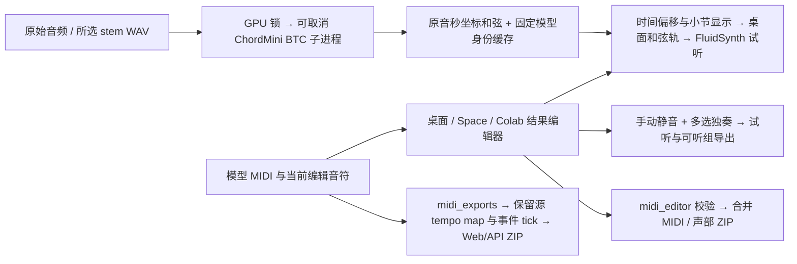

# 音色库与乐谱导出 / SoundFonts and sheet music

## MIDI 声部、和弦与走带

- 新结果默认所有声部可见、可听；重新打开结果不继承上一结果的静音或独奏。S 可多选，两条贝斯可一起试听、一起导出；手动静音优先于独奏，退出独奏后恢复原静音设置。
- “全部声部合并导出 MIDI”导出当前完整编辑；“当前可听声部合并导出 MIDI”应用静音和多选独奏；“所有声部分别导出 MIDI（ZIP）”不受试听选择影响，每个乐器一个带编号、名称和 BPM 的文件。同一乐器按编辑器声部归组，不按文件中的空元数据轨生成多余 MIDI。
- 编辑器导出沿用 `midi_editor.export_edited_midi` 的音符、tempo、拍号、CC64、pitch bend 和其他事件校验。ZIP 完整校验后才替换目标文件，原 MIDI 保持不变；没有可听声部时明确提示，不生成空文件。
- 空格播放/暂停，Shift+空格或停止按钮停止并回到零点，同时重置进度条、播放头和水平视图；文本、数值输入和下拉框保留键盘原行为。快捷键仅作用于当前获得焦点的结果编辑器。
- 本地桌面和弦轨使用与 TelkNet 默认工具相同的 **ChordMini BTC**，固定官方源码 `aa6e3a8d7b017f082fd2aaff9329d5c26af49c03` 和 `btc_model_best.pth`。原音按原采样率、原声道解码为 PCM32，再交给官方特征提取与推理；170 类完整标签涵盖 14 种和弦性质及 N/X，无和弦/不确定区间不试听。保留原生边界，只在小节处分割显示，MuScriptor 开头补齐偏移同步到和弦。小节、和弦、音符共用参考 BPM 和拍号；工程变速不会导致三者漂移，编辑 MIDI 不会改写原音和弦。后台分析可取消并与转写共用 GPU 锁；失败显示原因、点击重试，不替换为 MIDI 估计或 Omnizart。
- 点击和弦暂停整曲并通过当前 SoundFont 单独试听。取消、快速连续点击、停止和关闭编辑器会取消旧请求，防止较慢的旧试听覆盖新选择。

| 交付面 | 多选独奏、可听组导出、批量 MIDI、快捷键 | 和弦轨 |
|---|---|---|
| PyQt 桌面 / 便携 App / 可执行 App | 同一 `MuscriptorResultWidget` | 原音 ChordMini BTC 识别与 SoundFont 试听 |
| Space / Colab | 同一 `muscriptor_result_runtime` 浏览器实现 | 本次按反馈限定本地窗口 |
| 独立 Web/API / Docker / 便携 Web | 结果与恢复项目都支持批量 MIDI ZIP；没有 MIDI 编辑器，不适用 MIDI 独奏或编辑器快捷键 | 没有钢琴卷帘，不适用 |



## MIDI instruments, chords and transport

New results start with all instruments audible and visible. Solo is additive; manual mutes remain independent and take priority. Export all current notes, only the audible group, or all instruments as separate numbered MIDI files in one ZIP. Batch export ignores monitor selection and preserves the current project BPM and edits. Empty selections report an error instead of replacing a file.

Space plays/pauses; Shift+Space or Stop and rewind returns transport and horizontal view to zero. Text, numeric and select inputs retain normal keyboard behavior. Only the focused result editor receives transport shortcuts. The desktop uses TelkNet’s default ChordMini BTC recipe on source audio, with the exact pinned source and BTC checkpoint. Native-rate, original-channel PCM32 decoding precedes the official feature frontend. All 170 classes, including seventh/suspended qualities and N/X, retain their original boundaries. Bar splits affect display only; MuScriptor lead-in offsets and project tempo changes remain aligned. MIDI edits do not alter source-audio chords. Background inference shares the accelerator lock, supports cancellation and reports failures with click-to-retry; it never falls back to MIDI templates or Omnizart. Chord recognition remains a model prediction, not a guarantee of score accuracy.

Space and Colab share the browser mixer/export/transport implementation. Chord display is desktop-only as requested. Standalone Web/API, Docker and portable Web offer instrument ZIP downloads for both jobs and restored project results, preserving the source tempo map and event ticks. They have no MIDI editor/solo state, so editor-specific shortcuts and audible-group exports do not apply. Those browser surfaces retain their existing SoundFont/FluidSynth dependencies. Only desktop chord analysis requires the additional pinned ChordMini BTC resources.

## 使用音色库

桌面、Space 和 Colab 的 MIDI 结果页提供“音色库与乐器音色”。导入 `.sf2` 或 `.sf3` 文件，在“来源乐器”中逐项选择音色预设，再点击“应用音色”。选择下拉框本身不会改变试听。切回“默认音色库”并点击“应用音色”，可恢复默认声音。

应用后，主试听、独奏/静音、立体声对照、WAV 导出和分乐器 WAV 导出使用同一音色选择。WAV 保留现有两档规格：24-bit / 48 kHz 和 16-bit / 44.1 kHz。

独立 Web 的每个 MIDI 下载结果提供“音色试听”，分离后的逐轨 MIDI 结果也有此入口。应用音色后，可播放和下载 24-bit / 48 kHz WAV。API 接受两档音频规格。

- 单个音色库上限为 1 GiB。预设列表读取文件自身的名称、bank 和 program；编号显示为从 0 开始的 `bank:program`。
- 可导入多个库，并为当前结果选择一个活动库。各来源乐器可以选择活动库中的不同预设。
- 鼓轨选择 bank 128 的鼓组；旋律轨选择其他 bank 的旋律预设。缺少原乐器对应预设时，必须明确选择可用预设。
- 导入保留独立副本和 SHA-256 身份，渲染检查文件是否变化。无效文件、缺失预设和合成失败会报错。
- 自定义音色渲染不支持异步 Type 2 MIDI 或带 SysEx 音源控制的 MIDI，遇到这些情况会停止并说明原因。
- 桌面的导入库随当前结果保留；Space/Colab 随请求目录保留。独立 API 的音色库随对应任务保存和清理。

**音色库改变播放声音，不扩展 AI 模型的识别类别。** MIDI、MusicXML 和 PDF 保留转录/编辑后的原乐器编号，文件不嵌入用户音色库。MuScriptor 的官方模型及权重不作修改。

### 独立 API

以下接口使用已成功完成任务的 `job_id` 和 MIDI `artifact_id`。音色库 ID 仅在所属结果内有效。

| 方法 | 路径 | 用途 |
| --- | --- | --- |
| GET | `/api/v1/jobs/{job_id}/soundfonts/{artifact_id}` | 返回来源乐器和已导入库的预设目录 |
| POST | `/api/v1/jobs/{job_id}/soundfonts/{artifact_id}` | multipart 上传 `file`，返回音色库 ID 和真实预设 |
| POST | `/api/v1/jobs/{job_id}/soundfonts/{artifact_id}/render` | 按以下 JSON 返回 WAV |

```json
{
  "preset": "pcm24_48000",
  "soundfont": {
    "id": "上传响应中的 SHA-256 ID",
    "assignments": [
      {"source_program": 0, "is_drum": false, "bank": 8, "program": 80}
    ]
  }
}
```

`preset` 也支持 `pcm16_44100`。`soundfont: null` 使用默认音色库。以上预设示例必须存在于实际导入的库中；服务端不会替换不存在的预设。

## 乐谱导出

功能对照 MuScriptor 官方 [`sheets.py`](https://github.com/muscriptor/muscriptor/blob/e34b397bf0584e67bfd81dc591c390e6dcb03350/muscriptor/utils/sheets.py)，使用 MuseScore 4 排版。

桌面结果页选择“下载 → 乐谱包（MusicXML / PDF）”；Space/Colab 点击同名按钮；独立 Web 点击 MIDI 结果旁的“生成乐谱”。ZIP 包含：

- `score.mid`：用于排版的 MIDI 副本；
- `score.musicxml`：可继续编辑的乐谱；
- `full_score.pdf`：总谱；
- 按乐器编号命名的 PDF 分谱；
- 适用吉他/贝斯的 `_tab.pdf` 指法谱；
- `sheet_music_manifest.json`：源文件校验值、排版网格、音符数和 MuseScore 版本。

排版前仅量化私有 MIDI 副本。结果编辑器使用当前网格，默认 `1/32`；独立 Web 默认 `1/32`，API 可传 `quantize_grid`。源 MIDI 不被覆盖。MuseScore 不可用、没有真实输出、分谱失败或任务取消时不会发布成功结果。

乐谱是对当前 MIDI 的自动排版。它不保证修正模型识别错误，也不能保证所有自由节奏、复杂复调或指法选择都符合人工制谱要求；可在 MuseScore 中继续编辑 MusicXML。

## English

Import SF2/SF3 files in the MIDI result's **SoundFont and instrument sounds** panel. Select a preset for each source instrument and click **Apply sounds**. Selection alone does not render. Desktop, Space and Colab apply the selection to preview and WAV/stem exports. The standalone Web client provides a **SoundFont preview** action for each MIDI result, with playback and a 24-bit / 48 kHz WAV download. Its API also supports 16-bit / 44.1 kHz.

Each file is limited to 1 GiB. One imported library is active per result, with individual instrument assignments. Drum presets use bank 128. Missing presets, changed files, malformed banks and synthesis failures are explicit errors. Asynchronous Type 2 MIDI and SysEx sound-source control are unsupported for custom rendering. SoundFonts do not extend model recognition, alter the exported MIDI instruments, or become embedded in MIDI or sheet music.

**Sheet music (MusicXML / PDF)** exports a ZIP containing a MIDI engraving copy, MusicXML, full-score PDF, part PDFs, applicable guitar/bass tablature, and an integrity manifest. The implementation follows the official MuScriptor MuseScore workflow. Only a private copy is quantized for engraving; the original MIDI is preserved. Automatic engraving may still require human review for transcription accuracy, complex rhythm, voicing and fingering.

For deployment, the same shared modules serve desktop, Space, Colab, standalone API, Docker and portable launchers. Existing FluidSynth and MuseScore runtime requirements remain in effect. Desktop chord analysis additionally requires the pinned ChordMini BTC resources; run `python download_chordmini_model.py` or `python download_sota_models.py`. Full portable App builds include and verify these resources. Space/Colab and standalone Web/API/Docker do not expose the desktop chord lane or run its model; their existing shared exports and playback paths remain covered separately.
